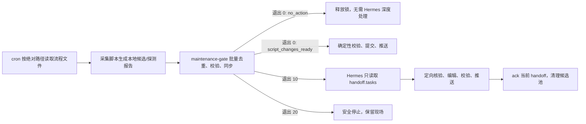

# CampBrief 长期维护流程

## 目标

长期维护采用“脚本先处理，Hermes 只处理例外”的两层结构。采集、去重、结构校验、生命周期状态同步、来源可达性和轮播健康度由确定性脚本批量完成；只有新候选、内容变化、零命中、多命中、来源错误、缺少可靠生命周期或需要编辑判断的字段才进入 Hermes。

cron 只负责决定何时按绝对路径读取对应流程文件。流程文件和脚本均不定义执行频率，也不依赖 Hermes skill 注册或 config 注入。



## 统一入口

`scripts/maintenance-gate.py` 是四个板块共同使用的批量维护入口。

| 退出码 | 含义 | 后续动作 |
|---|---|---|
| `0` | 不需要 Hermes 判断 | 读取报告中的 `decision`：`no_action` 直接结束；`script_changes_ready` 自动校验并发布脚本变更 |
| `10` | 出现新的或内容变化的例外任务 | Hermes 只读取报告的 `tasks`，不得重新通读完整候选池 |
| `20` | gate 自身无法安全完成 | 停止任务、保留锁外的候选与报告，不发布 |

常用参数：

- `--scope daily-news|daily-news-juya|exams|competitions|all`：维护范围。
- `--candidate-pool NAME=PATH`：传入采集器候选池，可重复使用。
- `--exam-report PATH`：传入考试官方页批量探测报告。
- `--daily-link-report PATH`：传入已发布资讯原文链接的批量检查报告。
- `--fix`：只对有结构化 lifecycle 的 scheduled 条目确定性同步状态。
- `--touch-last-updated`：仅在当前没有任何异常时写入成功核验时间。
- `--report PATH`：写入机器可读的 Hermes 交接报告。
- `--state PATH`：写入本地异常去重状态；必须位于被 Git 忽略的 `local-notes/`。
- `--ack REPORT`：Hermes 成功处理并完成发布后确认该批任务。

`--retry-after-hours` 是已确认异常的重复交接冷却期，不是巡检或定时任务执行频率。任务内容指纹发生变化时会立即重新交接，不受冷却期影响；未 ack 的任务也会在下一次运行继续交接，避免失败后丢任务。

## 交接报告

报告默认写入 `local-notes/maintenance/<scope>-handoff.json`，核心结构如下：

```json
{
  "schema_version": 1,
  "scope": "exams",
  "decision": "hermes_required",
  "exit_code": 10,
  "summary": {
    "checks_failed": 0,
    "tasks_emitted": 2,
    "tasks_suppressed": 5
  },
  "tasks": [],
  "suppressed": []
}
```

Hermes 只处理 `tasks`：

- `candidate_review`：未发布的新候选。
- `candidate_change`：已发布条目的来源字段发生变化。
- `exam_notice_review`：考试公告新命中、多命中、零命中、动态页变化或来源失败。
- `status_review` / `lifecycle_error`：状态缺少可靠边界、复核期限已过或生命周期非法。
- `content_completion`：GitHub 趋势项目缺少中文概述等编辑字段。
- `link_review`：已发布资讯原文失效、访问受限或出现网络错误，只需定向复核报告中的 URL 与条目 ID。
- `source_error` / `validation_error`：采集源或确定性校验失败。

`suppressed` 只保存已由 Hermes ack 且内容未变化的重复异常摘要，不包含待处理任务。Hermes 未成功完成发布时不得 ack，也不得删除候选池。

## 资讯链接批量检查

`scripts/check-daily-news-links.py` 会按 URL 去重并并发检查已发布资讯。两个资讯 skill 通过来源过滤各自处理自己的条目，避免重复交接：

- `campbrief-daily-news` 使用 `--exclude-source "juya AI 日报"`。
- `campbrief-daily-news-juya` 使用 `--only-source "juya AI 日报"`。
- `ok` 不进入 handoff；`broken`、`restricted`、`error` 由 gate 生成 `link_review`。
- Hermes 不得重新扫描全量链接，只复核 `link_review.payload` 中的 URL 和 `ids`。

示例：

```bash
python3 scripts/check-daily-news-links.py \
  --exclude-source "juya AI 日报" \
  --report local-notes/maintenance/daily-news-link-report.json

python3 scripts/maintenance-gate.py \
  --scope daily-news \
  --daily-link-report local-notes/maintenance/daily-news-link-report.json \
  --report local-notes/maintenance/daily-news-handoff.json \
  --state local-notes/maintenance/daily-news-state.json
```

## 考试来源批量探测

`scripts/collect-exam-notices.py` 会对相同 `news_list_url` 只下载一次，再按每个考试的 `source-policy.json` 独立判断：

- 当前公告仍在列表中：脚本判定为 `current`。
- 官方固定入口可访问：判定为 `reachable_current`。
- 新链接唯一命中：生成候选交给 Hermes 解析正文。
- 多个链接命中、没有命中、页面只有前端壳或请求错误：交给 Hermes 定向兜底。
- `schedule-page` 和动态同页公告只计算正文指纹；正文变化时立即交给 Hermes，脚本不自行解析日期。

示例：

```bash
python3 scripts/collect-exam-notices.py \
  --output local-notes/maintenance/exam-notice-probe.json

python3 scripts/maintenance-gate.py \
  --scope exams --fix --touch-last-updated \
  --exam-report local-notes/maintenance/exam-notice-probe.json \
  --report local-notes/maintenance/exams-handoff.json \
  --state local-notes/maintenance/exams-state.json
```

## 安全边界

- 脚本不得从标题、摘要、`status_hint`、`timeline`、`signup` 或 `schedule` 猜测发布状态。
- 采集器产生的启发式状态只能作为 Hermes 查找线索，不能直接写入发布数据。
- 新公告和候选链接必须由 Hermes 打开官方原文后才能更新展示字段或 lifecycle。
- gate 只会自动修改结构化 scheduled 状态和无异常批次的 `last_updated`。
- 候选池、探测报告、handoff 和 state 全部位于 `local-notes/`，永不提交到 Git。
- 发布仍须通过对应数据校验、`check-carousel-health.py` 和 `git diff --check`，并坚持 `git pull --ff-only`，禁止强制推送。
- GitHub Trending 发布前必须通过 `validate-github-trending.py`；Hermes 只补 `content_completion` 指向的 repo，不得在 gate 前通读榜单。
